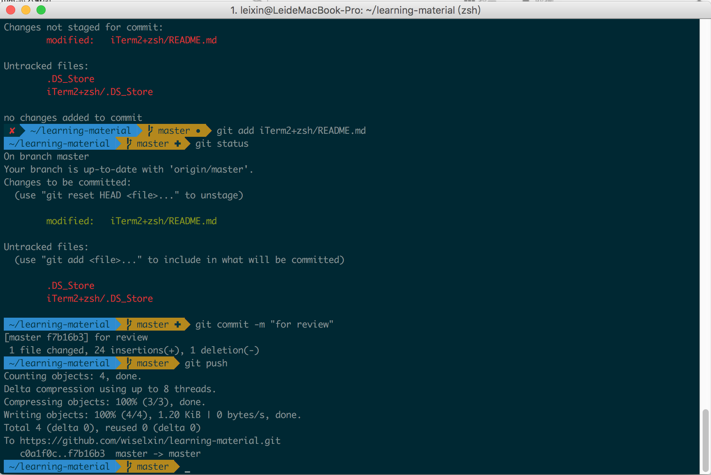

#How to make your Mac Terminal more professional

##Install iTerm2
iTerm2 is more powerful Terminal than Mac default one, you can download from [iTerm2](http://www.iterm2.com).
Install it is easy on Mac OS. Just need move it into "Application" folder.

##Setting for zsh(Z Shell)
Z shell is the best shell because of the name is "Z" which is the latest alphabet. That is a just joke. But the Z shell is great shell, it provide "command auto complete", and support other shell command. Most Linux user can easily use it.

Mac OS has already installed the Z shell by default. you can use command "cat /etc/shells" to check all system shells. Then you need to set the default shell as "zsh" for terminal via command "chsh -s /bin/zsh".   

In fact the configuration of "zsh" is a most complex and difficult stuff. Now one geek who published his configuration called "oh my zsh" to us make us more easy to config it. we just need do 2 manual steps:
  
git clone git://github.com/robbyrussell/oh-my-zsh.git ~/.oh-my-zsh
cp ~/.oh-my-zsh/templates/zshrc.zsh-template ~/.zshrc

If you do not have git installed, the Mac OS will ask you to install Xcode at first.

##Theme and font 
After you imported the "oh my zsh", you can choose your favorite theme.

Open file ~.zshrc and add following:
ZSH_THEME="agnoster"  #Most popular 
DEFAULT_USER="your Mac user name"  #Can hide path of user 

Install new font [Monaco-for-Powerline](https://github.com/supermarin/powerline-fonts/blob/bfcb152306902c09b62be6e4a5eec7763e46d62d/Monaco/Monaco%20for%20Powerline.otf), otherwise you will see some "?" in the path

After install do not forget to set iTerm2 font setting.