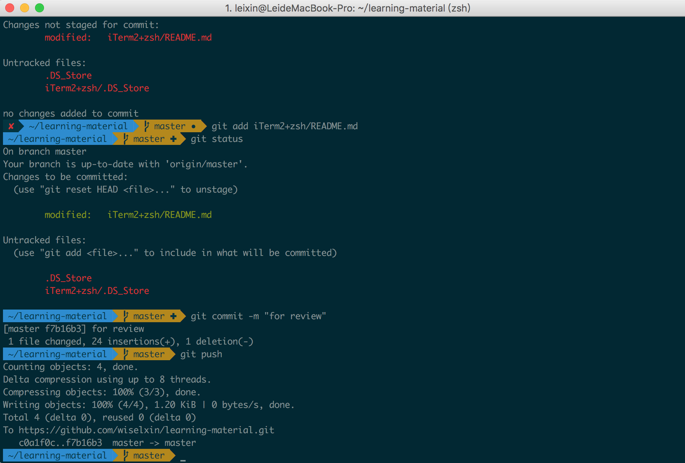

# How to make your Mac Terminal more professional

## Install iTerm2
[iTerm2](http://www.iterm2.com) is more powerful Terminal than Mac default one.Installing is very easy on Mac OS. You just need download it, and move it into "Application" folder.
There is a good color theme [Solarized](http://ethanschoonover.com/solarized) for iTerm2 as I showed it above. After downloading, open "solarized/iterm2-colors-solarized/" and double click file then done!

## Setting for Z Shell(zsh)
"Z shell" is the best shell because of the name is "Z" which is the latest alphabet. That is just a joke. "Z shell" provides "command auto complete", and support other shell command. Most Linux user can easily use it as before(such as bash).

Mac OS has already installed "Z shell" by default. You can use following command to check all system shells.
>cat /etc/shells 

To make sure your system has installed zsh, then you need to set the default shell as "zsh" for terminal via command

>chsh -s /bin/zsh

In fact the configuration of "zsh" is a most complex and difficult stuff. Now one geek who published his configuration called "oh my zsh" make us easy to configure it. There are 2 manual steps:
  
>git clone git://github.com/robbyrussell/oh-my-zsh.git ~/.oh-my-zsh  
cp ~/.oh-my-zsh/templates/zshrc.zsh-template ~/.zshrc

If you do not have "Git" installed, that Mac OS will ask you to install "Xcode" at first.

## Theme and Font 
After you imported the "oh my zsh", you can choose your favorite theme.

Open file ~.zshrc and add following:
>ZSH_THEME="agnoster"  #Most popular  
DEFAULT_USER="your Mac user name"  #Can hide path of user

### Integrating with [powerline-fonts](https://github.com/powerline/fonts)
if you not install the powerline-fonts, you will see some "?" in your iTerm2 status-line.
Choose one of fonts to install and set iTerm2 font with new installed. 

## Reference 
http://www.tuicool.com/articles/FFN7Vbq

